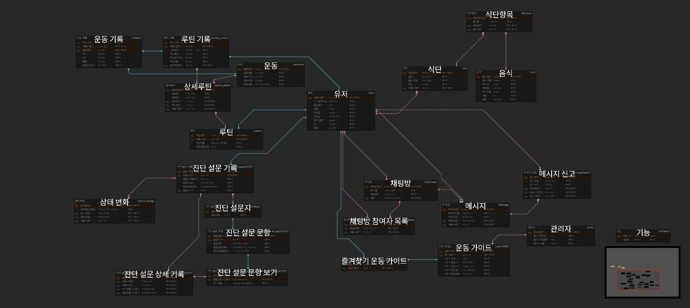

# be22-1st-team3-project

- 프로젝트 간단 소개
> 헬스하는 사람들을 위한 관리 서비스를 개발하고 있습니다.
- 팀 소개
> 조민규, 정현호, 김선일, 최현지
- 프로젝트 개요(주제 소개, 선정 이유(배경/필요성))
> 헬스케어
> 오늘날 각광받는 헬스케어
> 웹에서 식단관리, 루틴관리, 채팅을 통합해서 제공하는 플랫폼은 없음.
> 이를 제공해서 헬스하는 사람들에게 편의성을 제공하자.
- 유사 서비스 + 차이점 or 개선점
> 조사 필요
- 서비스 대상
> 헬스하는 사람들
- 주요 기능
> 식단관리, 루틴관리, 부상 자가진단, 사용자 채팅, 챗봇
- 개발 환경 및 기술 스택
> MariaDB, DataGrip, GitHub
- WBS
> ??
- Usecase Diagram (이미지 캡쳐)
> 
- 요구 사항 명세서 (이미지 또는 전체 공개된 url)
> 
- ERD (이미지)
> 
- 테이블 정의서(이미지 또는 전체 공개된 url)
> 작업 필요
- 백업 계획
    - replication을 통한 master - slave 연결 로직, 실제 모습 캡쳐
> 작업 필요
- 테스트케이스
    - 시나리오별 SQL 및 실행 결과
> 작업 필요
- 프로젝트 회고
> 조민규 :
> 정현호 :
> 김선일 :
> 최현지 : 
